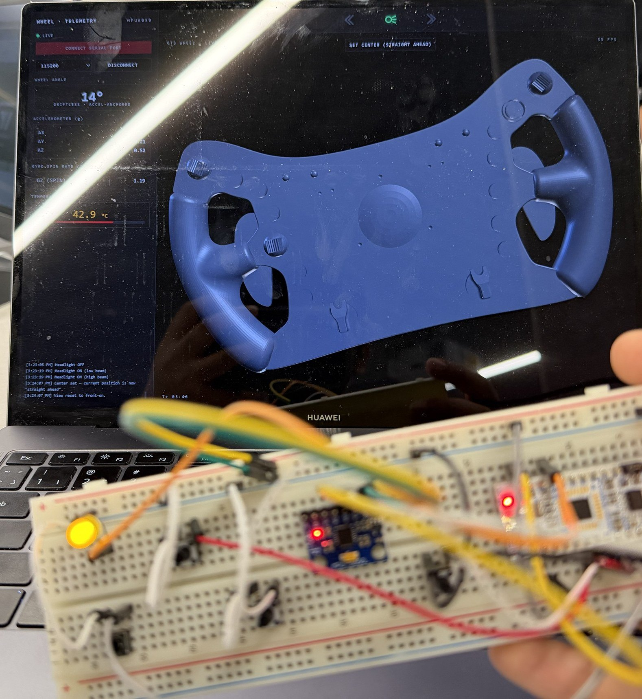
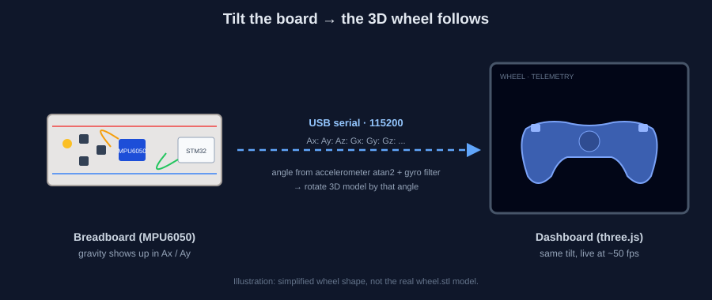
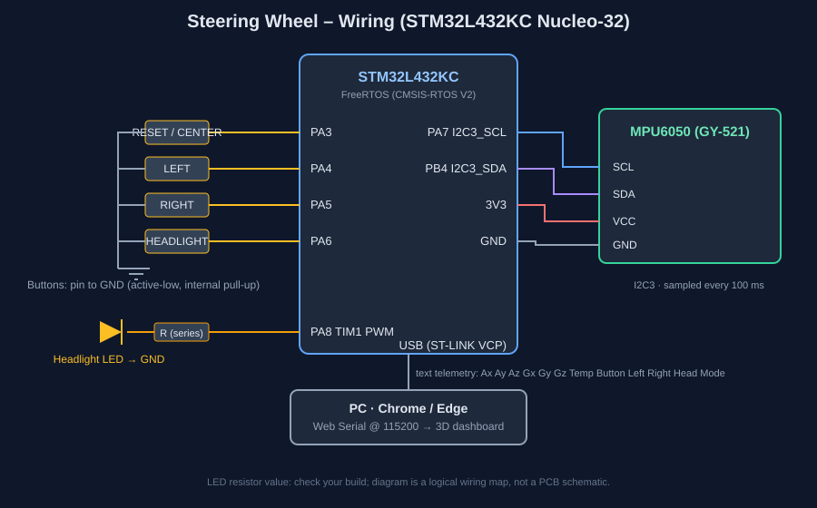
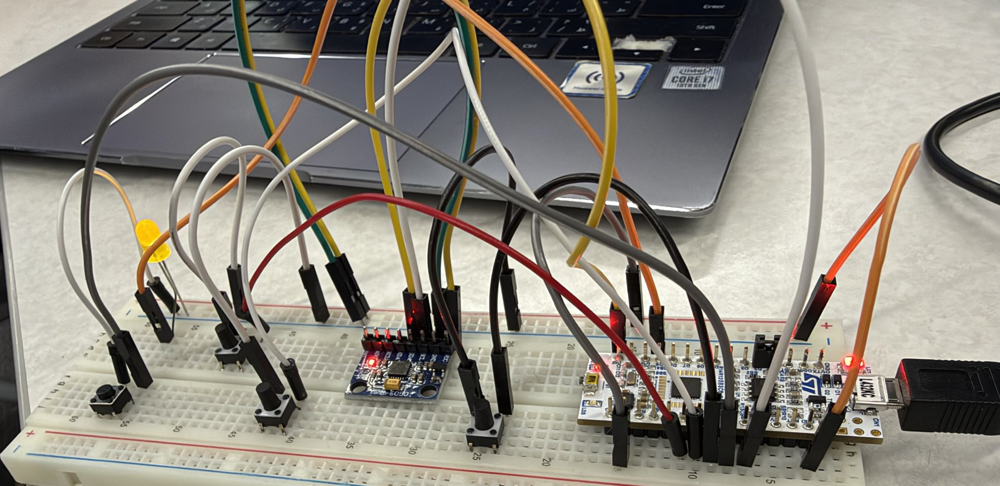
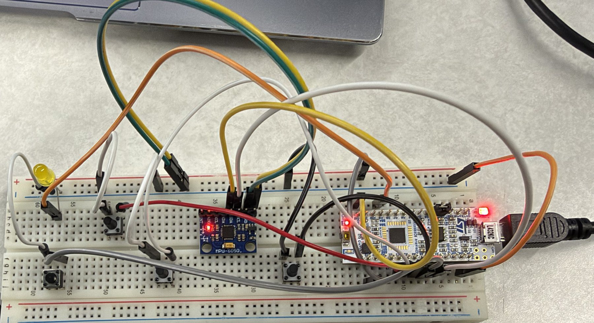
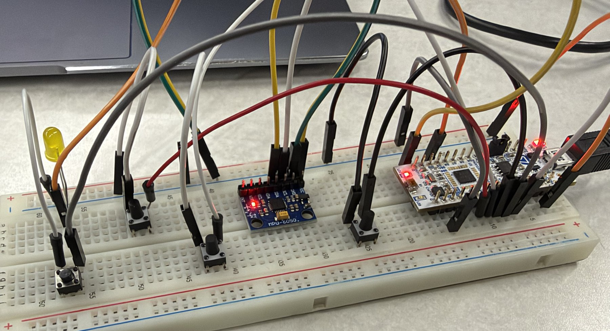
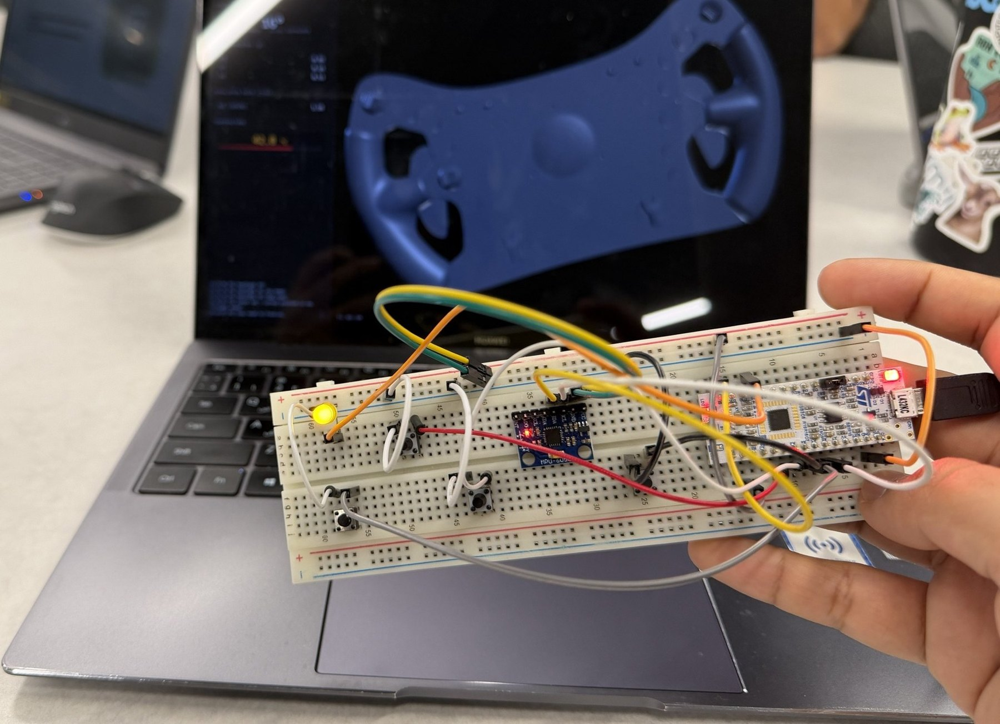
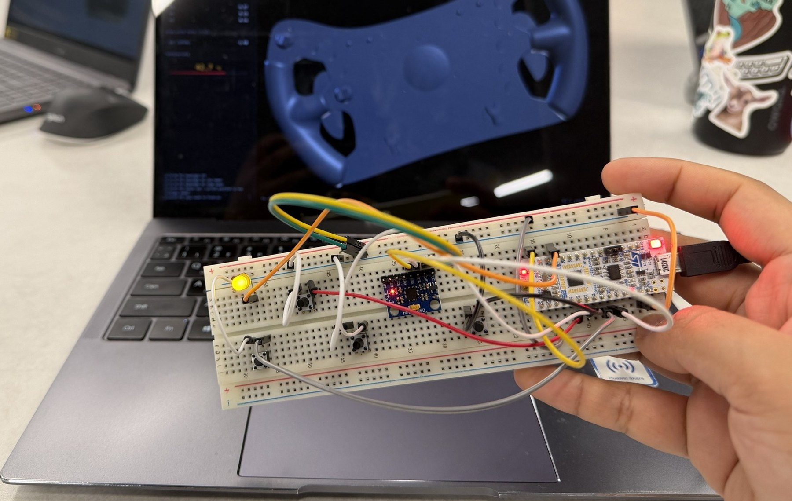
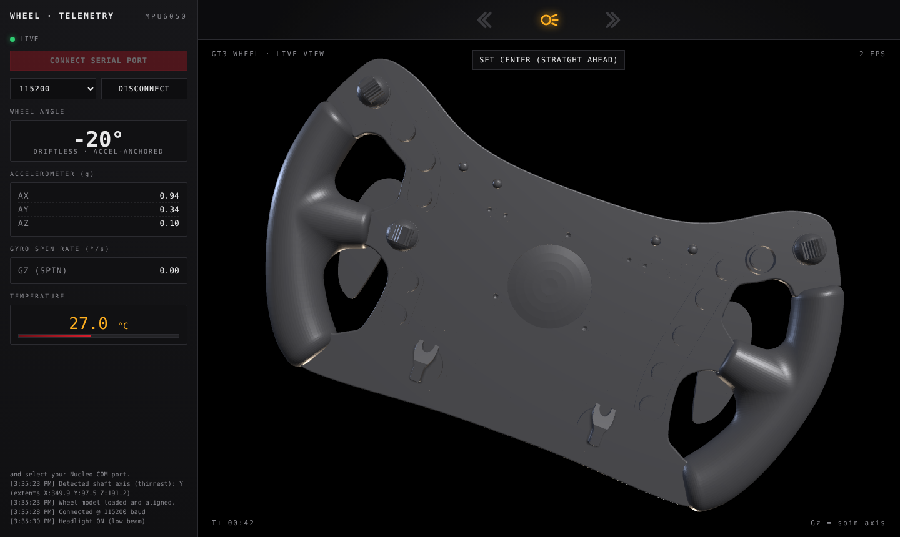

# Steering Wheel – IMU + Buttons + 3D Dashboard

STM32L432KC (Nucleo-32) FreeRTOS firmware that reads an MPU6050 IMU and four buttons, drives a PWM headlight LED, and streams text telemetry over USB. A browser dashboard (Web Serial + three.js) turns that stream into a live 3D steering wheel with blinkers and a headlight indicator.



## How it works

Tilt the breadboard and the wheel on screen turns with it.



1. The MPU6050 measures gravity (Ax / Ay / Az) and rotation (Gx / Gy / Gz).
2. The firmware sends one text line over the ST-LINK virtual COM port at 115200 baud.
3. The dashboard computes the wheel angle from the accelerometer (anchored, so it doesn't drift), then rotates the STL model.

Telemetry line format:

```
Ax:0.94 Ay:0.34 Az:0.10 Gx:0.00 Gy:0.00 Gz:0.00 Temp:27.00C Button:0 Left:0 Right:0 Head:1 Mode:1
```

`Button` = reset/center, `Left` / `Right` = blinkers, `Head` = headlight button, `Mode` = headlight mode (0 off, 1 low, 2 high).

## Hardware



| Function | Pin | Notes |
|---|---|---|
| Reset / center button | PA3 | active-low, internal pull-up |
| Left blinker button | PA4 | active-low, internal pull-up |
| Right blinker button | PA5 | active-low, internal pull-up |
| Headlight button | PA6 | cycles off / low / high |
| Headlight LED | PA8 (TIM1_CH1 PWM) | through a series resistor |
| MPU6050 SCL / SDA | PA7 / PB4 (I2C3) | 3V3 + GND |
| Telemetry | USB (ST-LINK virtual COM) | 115200 baud |

### The build

| | |
|---|---|
|  |  |
|  |  |



## Dashboard



*Screenshot rendered with simulated serial data (about 20° tilt, headlight on).*

Run it locally (Chrome or Edge, because Web Serial is not in Firefox/Safari):

```bash
cd frontend
python -m http.server 8000
```

Then:
1. Open <http://localhost:8000> in Chrome or Edge.
2. Plug in the Nucleo over USB.
3. Click **Connect serial port**, pick the Nucleo COM port, and keep the baud rate at 115200.
4. Hold the board straight ahead and click **Set center**.

Python 3 is the only requirement. Opening `index.html` by double-clicking won't work, because the page has to load `wheel.stl` from a server (`file://` is blocked) and Web Serial needs `localhost`.

Notes:
- Needs internet on first load (three.js comes from a CDN).
- Close any other program holding the COM port (PuTTY, YAT, the IDE console).
- After you disconnect, reload the page before reconnecting (known issue).

## Firmware

Built with STM32CubeIDE / CubeMX and FreeRTOS via CMSIS-RTOS V2. Edit code only inside `USER CODE BEGIN / END` blocks so CubeMX regeneration keeps it.

| Task | Priority | Job |
|---|---|---|
| SensorTask | Above normal | Reads the MPU6050 every 100 ms, posts to `sensorQueue` |
| HeadlightTask | Normal | Debounces PA6, cycles headlight mode, sets PWM duty |
| LeftTask / RightTask / ResetTask | Normal | Debounce a button and post its state every 20 ms |
| UartTask | Low | Waits for a sensor sample, drains the button queues, prints one line |

Each button has its own queue (depth 8) so short taps aren't lost. `main.c` initialises the IMU and calibrates the gyro (keep the board still at power-up) before the scheduler starts.

Known limitations: stack sizes are not tuned (raise UartTask/SensorTask stacks if it freezes), IMU read errors are silent, and pitch/roll in the driver are unused.

## Contributing

- Work on a branch (this one is `Wheel-IMU`) and open a pull request into the team repo.
- Keep commits small, with a message that says what changed and why.
- Don't commit build output (`Debug/`, `Release/`, `*.elf`, `*.launch`); `.gitignore` already covers them.
- If you change pins or peripherals, change them in the `.ioc` file and regenerate rather than editing generated code by hand.
- Test on hardware before opening a PR and say what you tested.